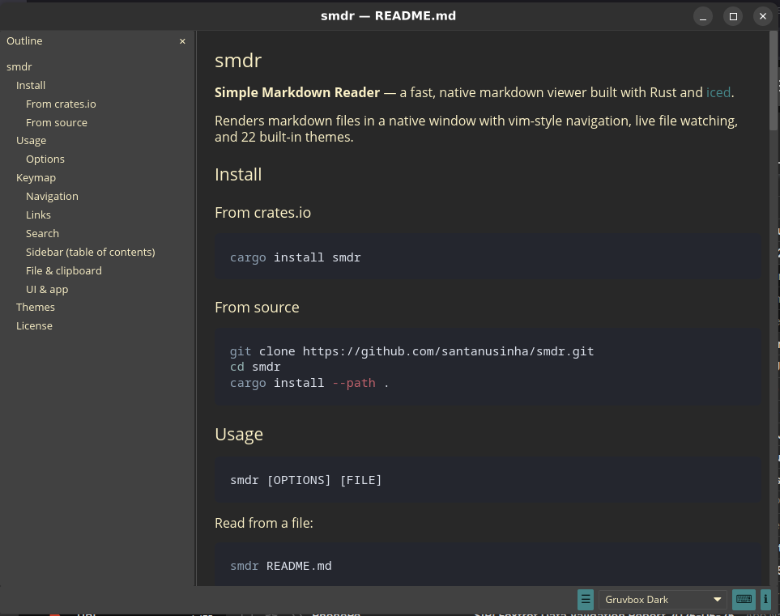

# smdr

Simple Markdown Reader — a fast, native markdown viewer built with Rust.

Renders markdown files in a native window with vim-style navigation, live file watching, and multiple themes.



---

## Install

### Homebrew (macOS / Linux)

```sh
brew tap santanusinha/smdr https://github.com/santanusinha/smdr
brew install smdr
```

### From crates.io

```sh
cargo install smdr
```

### From source

```sh
git clone https://github.com/santanusinha/smdr.git
cd smdr
cargo install --path .
```

### Pre-built binaries

See [Releases](https://github.com/santanusinha/smdr/releases).

---

## Usage

```
smdr [OPTIONS] [FILE]...
```

Read from a file:

```sh
smdr README.md
```

Open several files at once — each opens in its own tab:

```sh
smdr README.md CHANGELOG.md docs/index.md
```

Read from stdin:

```sh
cat README.md | smdr
```

!!! tip "Tabs & single window"
    smdr keeps everything in one window. Passing multiple files opens each in
    its own tab, and running `smdr <file>` again while a window is already
    open adds that file as a tab in the **existing** window instead of
    launching a new one — the command returns immediately without blocking
    your shell.

    Opening a file that is already open doesn't create a duplicate: smdr
    switches to its tab and reloads it from disk.

!!! tip "Live file watching"
    Pass `-w` / `--watch` and smdr will monitor the file for changes and
    automatically reload the view whenever you save — ideal for editing
    workflows, documentation previews, and note-taking.

    ```sh
    smdr -w README.md
    ```

    Already viewing a file without `-w`? Press **`Ctrl-R`** at any time
    to manually reload from disk.

### Options

| Flag | Description |
|------|-------------|
| `-w`, `--watch` | Watch file for changes and auto-reload |
| `-t`, `--theme <THEME>` | Color theme (default: `system`) |
| `--no-network` | Disable network image fetching (use local files only) |
| `--list-themes` | List available themes and exit |
| `--review` | Open file in review mode |
| `--annotations-in <PATH>` | Annotations JSON file (enables headless review) |
| `--out <PATH>` | Write review output to `<PATH>` instead of stdout |
| `--format <FORMAT>` | Output format: `json` (default), `md`, or `diff` |

!!! tip "stdin support"
    smdr automatically detects piped input — no flag needed:
    ```sh
    cat README.md | smdr
    man git | smdr
    ```

---

## Review mode

smdr includes an interactive review mode for annotating Markdown documents
line-by-line and exporting the result in several formats.

### Interactive review

```sh
smdr --review README.md
```

The source is displayed with a numbered gutter. Click any line number to open
the comment composer for that line; press `Esc` to cancel. Click
**Submit review** (or press `Ctrl-Enter`) to emit output and exit.

**Draft auto-save** — unsaved comments survive window close and are restored
the next time you open the same file with `--review`. Drafts are cleared on
submit.

### Headless (one-shot) review

Pass `--annotations-in` to run without a GUI:

```sh
smdr --review --annotations-in annotations.json --format md --out review.md README.md
```

smdr reads the annotations, merges them with the source, writes output, and
exits immediately.

### Output formats

| Value | Description |
|-------|-------------|
| `json` | Structured JSON envelope (default) — schema-tagged, one object per annotation |
| `md` | Annotated Markdown with `<!-- smdr: … -->` comment blocks inserted after each annotated line |
| `diff` | Insertion-only unified diff with 6 lines of context per hunk |

### JSON envelope schema

The `json` format (and the `--annotations-in` input) use a `ReviewEnvelope` object:

```json
{
  "schema": "smdr.review/v1",
  "file": "README.md",
  "comments": [
    { "line": 0, "comment": "Title looks good." },
    { "line": 7, "comment": "Add a quickstart example here." }
  ]
}
```

| Field | Type | Notes |
|-------|------|-------|
| `schema` | string | `"smdr.review/v1"` — bump on breaking changes |
| `file` | string | Path to the reviewed file (informational) |
| `comments[].line` | integer | **0-based** source line the comment is anchored to |
| `comments[].comment` | string | Freeform review note |

!!! note "Draft lifetime"
    Drafts are stored in `$TMPDIR/smdr-drafts/` until you submit or delete
    them manually. Automatic expiry is planned for a future release.

---

## Using smdr review mode from AI agents

smdr's review mode is designed to be used programmatically: an AI agent writes
a plan or todo list to a temporary Markdown file, opens it in smdr, waits for
you to annotate it, then reads the JSON feedback and acts on your comments.

This gives you **line-level control** over any content an agent produces before
it takes irreversible action.

### The `smdr-review` agent skill

If you are using the [Sai](https://github.com/santanusinha/sai) agent framework,
there is a ready-made skill that encapsulates this entire workflow.

Install it by copying `SKILL.md` into your skills directory
(`~/.config/sai/skills/smdr-review/SKILL.md`). The skill is available
in the [smdr repository](https://github.com/santanusinha/smdr) under
`skills/smdr-review/`.

Once installed, the agent will automatically open smdr for human sign-off
when it detects phrases like:

- _"get feedback on this plan"_
- _"let me review"_ / _"user review"_ / _"need sign-off"_
- _"ask the user to annotate"_
- any situation where a plan or todo list was produced before an irreversible step

### How it works (shell)

You can also drive this workflow directly from a shell script or any language
that can run a subprocess:

```bash
# 1. Write the content to a temp file
REVIEW_FILE=$(mktemp /tmp/smdr-review-XXXXXX.md)
cat > "$REVIEW_FILE" << 'EOF'
# Deployment plan

## Phase 1 — pre-flight
- [ ] Run migration dry-run
- [ ] Confirm backup exists

## Phase 2 — deploy
- [ ] Apply migration
- [ ] Restart service
EOF

# 2. Open review mode; stdout is the JSON envelope
FEEDBACK=$(smdr --review "$REVIEW_FILE")

# 3. Print each comment
echo "$FEEDBACK" | jq -r '.comments[] | "Line \(.line): \(.comment)"'

# 4. Clean up
rm -f "$REVIEW_FILE"
```

Or save the output to a file and post-process it:

```bash
smdr --review --out /tmp/feedback.json plan.md
jq '.comments' /tmp/feedback.json
```

### How it works (Python)

```python
import json, subprocess, tempfile, os

plan = """
# Refactoring plan

## Step 1
- Extract `render` into its own module

## Step 2
- Delete the old `view.rs`
"""

with tempfile.NamedTemporaryFile(suffix=".md", delete=False, mode="w") as f:
    f.write(plan)
    path = f.name

result = subprocess.run(
    ["smdr", "--review", "--out", "/tmp/smdr-fb.json", path],
)
feedback = json.loads(open("/tmp/smdr-fb.json").read())
os.unlink(path)
os.unlink("/tmp/smdr-fb.json")

for c in feedback["comments"]:
    print(f"Line {c['line']}: {c['comment']}")
```

### Mapping comments back to source lines

Line numbers in `comments[].line` are **0-based**. To read the actual content
of a commented line:

```bash
# bash — line 4 (0-based) is sed line 5
sed -n "5p" plan.md

# Python
lines = open("plan.md").readlines()
print(lines[4])   # index 4 == line 4 (0-based)
```

### Headless path (no GUI)

In CI or headless environments, skip the GUI entirely — write an
annotations file yourself and use `--annotations-in` to render the output:

```bash
cat > annotations.json << 'EOF'
{
  "schema": "smdr.review/v1",
  "file": "plan.md",
  "comments": [
    { "line": 3, "comment": "Missing rollback step." }
  ]
}
EOF

smdr --review --annotations-in annotations.json --format md --out report.md plan.md
```
---

## Keymap

### Navigation

| Key | Action |
|-----|--------|
| `j` / `↓` | Scroll down |
| `k` / `↑` | Scroll up |
| `Ctrl-D` / `PgDn` / `Space` | Page down |
| `Ctrl-U` / `PgUp` | Page up |
| `gg` / `Home` | Scroll to top |
| `GG` / `End` | Scroll to bottom |
| ` `` ` | Jump to last position |
| `h` / `←` | Navigate back |
| `l` / `→` | Navigate forward |

### Links

| Key | Action |
|-----|--------|
| `Tab` | Focus next link |
| `Shift-Tab` | Focus previous link |
| `Enter` | Activate focused link (or next search hit) |

### Search

| Key | Action |
|-----|--------|
| `/` | Open search |
| `Ctrl-F` | Open search |
| `n` | Next search hit |
| `p` | Previous search hit |
| `Esc` | Close search |

### Sidebar (table of contents)

| Key | Action |
|-----|--------|
| `Ctrl-B` | Toggle sidebar visibility |
| `o` | Focus / unfocus sidebar |
| `j` / `↓` | Next heading (when sidebar focused) |
| `k` / `↑` | Previous heading (when sidebar focused) |
| `Enter` | Jump to heading (when sidebar focused) |

### Tabs

When more than one document is open, a tab bar appears at the top. Each tab
has a close (✕) button, and clicking a tab switches to it.

| Key | Action |
|-----|--------|
| `Ctrl-Tab` / `gt` | Next tab |
| `Ctrl-Shift-Tab` / `gT` | Previous tab |
| `Ctrl-W` | Close current tab |

### File & clipboard

| Key | Action |
|-----|--------|
| `Ctrl-R` | Reload file from disk |
| `Ctrl-C` | Copy document to clipboard |

### UI & app

| Key | Action |
|-----|--------|
| `Ctrl-T` | Cycle theme |
| `?` | Show keyboard shortcuts |
| `qq` / `ZZ` | Exit |
| `Esc` | Close overlay / unfocus sidebar / cancel comment composer |

### Review mode

| Key / Action | Behaviour |
|---|---|
| Click gutter line | Open comment composer |
| `c` | Toggle source / comment-overlay view |
| `Esc` (in composer) | Cancel comment without saving |
| `Ctrl-Enter` | Submit review and exit |

### Mermaid diagrams

Click any Mermaid diagram to open it in a full-screen modal.

| Key | Action |
|-----|--------|
| `Ctrl-=` / `Ctrl-+` | Zoom in |
| `Ctrl--` | Zoom out |
| `j` / `↓` | Scroll down |
| `k` / `↑` | Scroll up |
| `h` / `←` | Scroll left |
| `l` / `→` | Scroll right |
| `Esc` | Close modal |

---

## Themes

smdr ships with 22 built-in themes. Use `--list-themes` to see all options.

| Theme | Style |
|-------|-------|
| `system` | Follows OS dark/light preference |
| `light` | Light |
| `dark` | Dark |
| `dracula` | Dark, vibrant |
| `nord` | Arctic blue |
| `solarized-light` | Warm light |
| `solarized-dark` | Warm dark |
| `gruvbox-light` | Retro light |
| `gruvbox-dark` | Retro dark |
| `catppuccin-latte` | Pastel light |
| `catppuccin-frappe` | Pastel mid-dark |
| `catppuccin-macchiato` | Pastel dark |
| `catppuccin-mocha` | Pastel darkest |
| `tokyo-night` | Purple/blue dark |
| `tokyo-night-storm` | Lighter variant |
| `tokyo-night-light` | Light variant |
| `kanagawa-wave` | Blue dark |
| `kanagawa-dragon` | Darker variant |
| `kanagawa-lotus` | Light variant |
| `moonfly` | Emerald dark |
| `nightfly` | Blue dark |
| `oxocarbon` | IBM Carbon dark |
| `ferra` | Warm muted dark |


---

## License

MIT
